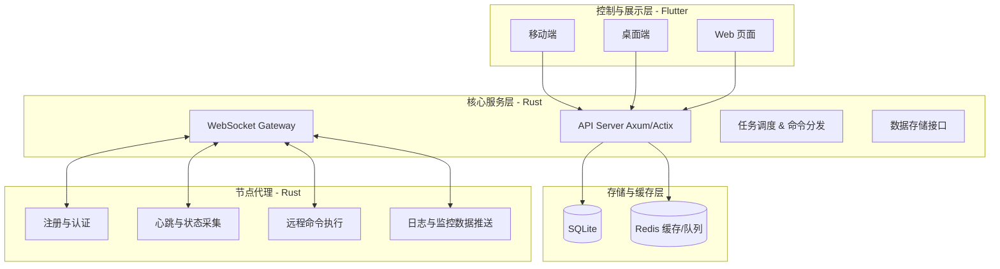
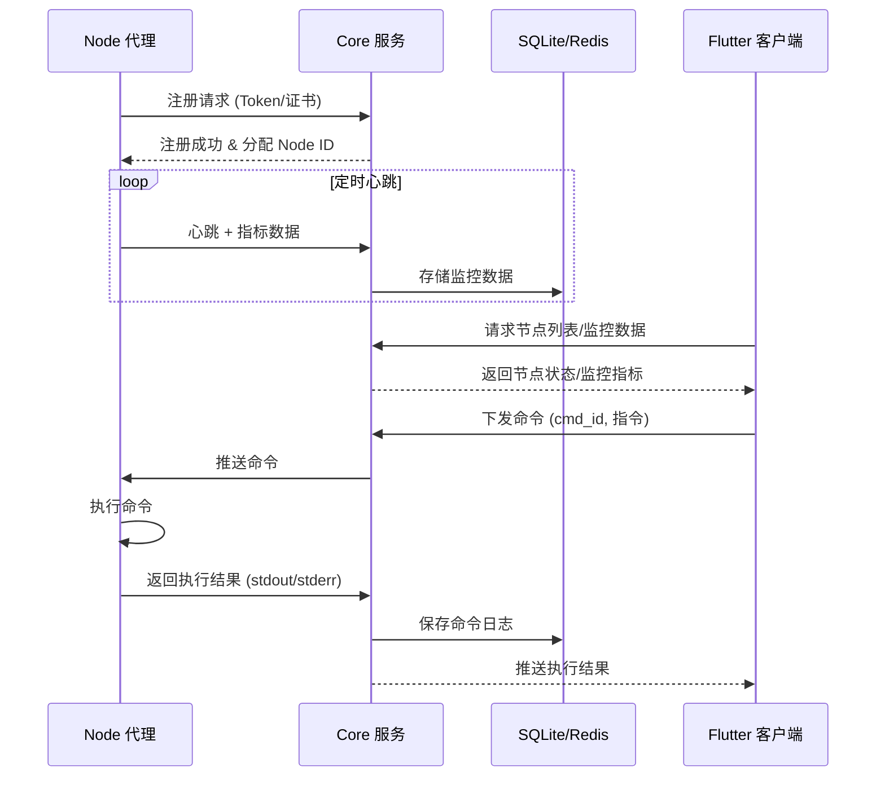

# 分布式服务器管理系统 (Server Manager)

一个 **轻量级、开箱即用** 的分布式服务器管理系统。采用 **Rust** 实现核心服务与节点代理，使用 **Flutter** 构建跨平台客户端，支持 **移动端、桌面端与 Web 页面**。系统专注于 **分布式节点管理、实时监控与远程运维**，无需繁琐配置即可快速投入使用。

---

## 使用流程

1. 启动core, 获取secret_key
2. 配置node中的 secret_key
3. 配置client中的 secret_key

## 系统架构

---

## 系统流程

---

## 核心功能

### 节点管理

* 节点自动注册与身份验证（共享 Token 或证书）
* 心跳检测与实时状态监控
* 节点分组与标签管理
* 批量操作与指令下发

### 系统监控

* CPU、内存、磁盘、网络等实时监控
* 历史数据存储与趋势查询（SQLite 存储）
* 执行结果与采样数据的持久化

### 远程控制

* Shell 命令远程执行（异步返回结果）
* 系统服务控制（启动/停止/重启）
* 完整的日志与审计追踪

### 安全机制

* Token 或证书认证的节点注册流程
* 全链路 TLS 通信加密
* 命令与执行结果的审计记录
* 可扩展 RBAC（角色与权限控制）

### 界面与扩展

* Flutter 跨平台客户端（移动端、桌面端、Web 页面）
* 响应式 UI，支持暗黑模式
* 可扩展的 REST API / WebSocket 接口

---

## 技术选型

| 层级        | 技术选型                                   |
| --------- | -------------------------------------- |
| 节点代理      | Rust (tokio, async, sysinfo)           |
| 核心服务 Core | Rust (axum/actix-web) + SQLite + Redis |
| 通信协议      | WebSocket + HTTP/REST                  |
| 数据存储      | SQLite（本地轻量数据库） + Redis（缓存/队列）         |
| 客户端展示     | Flutter（跨平台：移动、桌面、Web）                 |

---