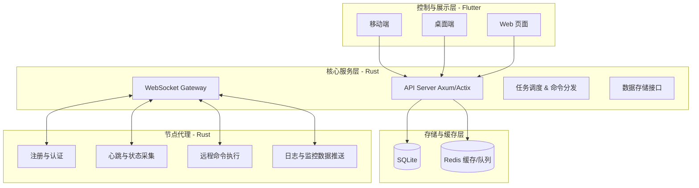
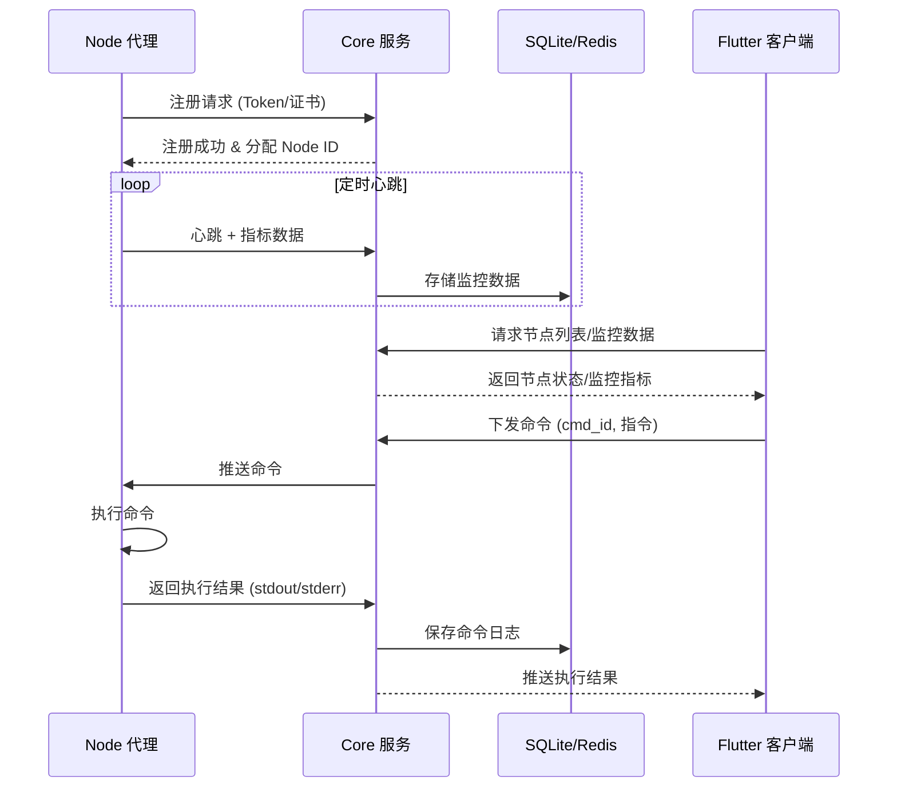

# 分布式服务器管理系统 (Server Manager)

一个 **轻量级、开箱即用** 的分布式服务器管理系统。采用 **Rust** 实现核心服务与节点代理，使用 **Flutter** 构建跨平台客户端，支持 **移动端、桌面端与 Web 页面**。系统专注于 **分布式节点管理、实时监控与远程运维**，无需繁琐配置即可快速投入使用。

---

## 📚 文档导航

### 核心文档
- **[API概述](docs/README_API.md)** - API接口快速索引
- **[服务器架构说明](docs/README_SERVER.md)** - 详细架构设计
- **[数据库设计](docs/数据库设计.md)** - 数据库表结构
- **[开发计划](docs/开发计划.md)** - 项目开发进度

### 开发指南
- **[Flutter客户端开发指南](docs/Flutter客户端开发指南.md)** - 客户端开发完整指南
- **[Node代理使用指南](docs/Node代理使用指南.md)** - Node代理安装配置

## 🚀 快速开始

### 1. 启动Core服务
```bash
cd server/core
cargo run
# 获取认证令牌
```

### 2. 配置Node代理
```bash
cd server/node
# 配置config/default.toml中的token
cargo run
```

### 3. 启动Flutter客户端
```bash
cd client
flutter run
```

## 系统架构



---

## 系统流程



---

## 核心功能

### 节点管理

* 节点自动注册与身份验证（共享 Token 或证书）
* 心跳检测与实时状态监控
* 节点分组与标签管理
* 批量操作与指令下发

### 系统监控

* CPU、内存、磁盘、网络等实时监控
* 历史数据存储与趋势查询（SQLite 存储）
* 执行结果与采样数据的持久化

### 远程控制

* Shell 命令远程执行（异步返回结果）
* 系统服务控制（启动/停止/重启）
* 完整的日志与审计追踪

### 安全机制

* Token 或证书认证的节点注册流程
* 全链路 TLS 通信加密
* 命令与执行结果的审计记录
* 可扩展 RBAC（角色与权限控制）

### 界面与扩展

* Flutter 跨平台客户端（移动端、桌面端、Web 页面）
* 响应式 UI，支持暗黑模式
* 可扩展的 REST API / WebSocket 接口

---

## 🎯 核心特性

- **轻量级部署** - 单二进制文件，无复杂依赖
- **跨平台支持** - 支持多种操作系统和架构
- **实时监控** - CPU、内存、磁盘等系统指标实时采集
- **远程管理** - 安全的远程命令执行和结果查看
- **多端客户端** - Flutter跨平台客户端，支持移动端、桌面端、Web

---