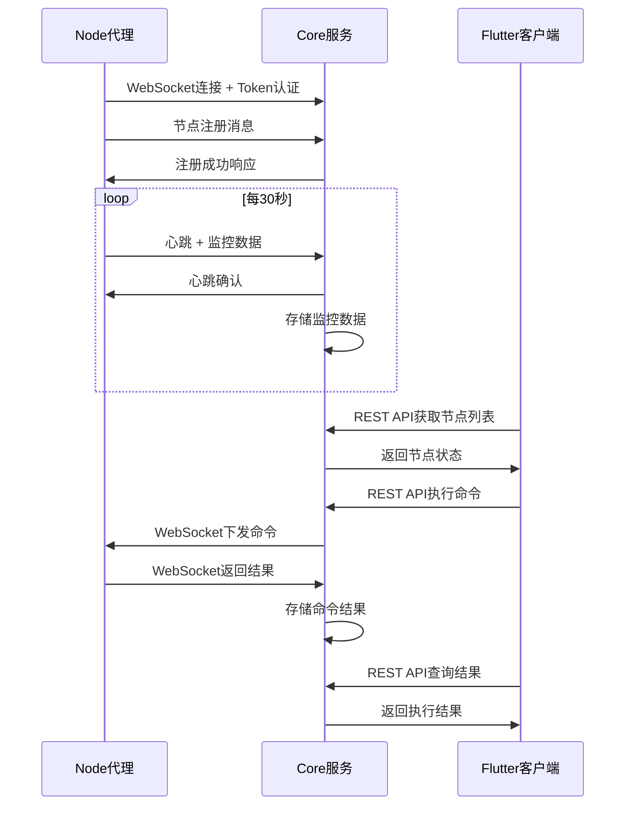

# 分布式服务器管理系统 - API设计文档 (MVP版本)

## 📋 概述

本文档定义了MVP版本的WebSocket和RESTful API接口设计，专注于核心功能：节点管理、监控数据采集和远程命令执行。

### 技术架构
- **WebSocket**: Node代理与Core服务实时通信
- **REST API**: Flutter客户端与Core服务数据交互
- **认证方式**: 简单Token认证

---

## 🔌 WebSocket 通信设计

### 连接方式
```
ws://localhost:9999/ws/node?token={TOKEN}&node_id={NODE_ID}
```

### 消息格式
所有WebSocket消息采用JSON格式：

```json
{
  "type": "message_type",
  "id": "message_id",
  "timestamp": "2025-01-21T10:00:00Z",
  "data": { /* 具体数据 */ }
}
```

### 1. 节点注册与认证

#### 节点注册 (Node → Core)
```json
{
  "type": "node_register",
  "id": "uuid",
  "timestamp": "2025-01-21T10:00:00Z",
  "data": {
    "node_id": "node-001",
    "hostname": "server-01",
    "ip_address": "192.168.1.100",
    "os_info": "Ubuntu 22.04 LTS"
  }
}
```

#### 注册响应 (Core → Node)
```json
{
  "type": "register_response",
  "id": "uuid",
  "timestamp": "2025-01-21T10:00:00Z",
  "data": {
    "success": true,
    "message": "节点注册成功"
  }
}
```

### 2. 心跳与监控数据

#### 心跳包 (Node → Core)
```json
{
  "type": "heartbeat",
  "id": "uuid",
  "timestamp": "2025-01-21T10:00:00Z",
  "data": {
    "node_id": "node-001",
    "status": "online",
    "metrics": {
      "cpu_usage": 45.2,
      "memory_usage": 68.5,
      "disk_usage": 34.1,
      "load_average": 1.23
    }
  }
}
```

#### 心跳响应 (Core → Node)
```json
{
  "type": "heartbeat_ack",
  "id": "uuid",
  "timestamp": "2025-01-21T10:00:00Z",
  "data": {
    "received": true
  }
}
```

### 3. 命令执行

#### 命令下发 (Core → Node)
```json
{
  "type": "execute_command",
  "id": "cmd-uuid",
  "timestamp": "2025-01-21T10:00:00Z",
  "data": {
    "command_id": "cmd-001",
    "command_text": "ls -la /home",
    "timeout": 30
  }
}
```

#### 命令开始响应 (Node → Core)
```json
{
  "type": "command_started",
  "id": "cmd-uuid",
  "timestamp": "2025-01-21T10:00:00Z",
  "data": {
    "command_id": "cmd-001"
  }
}
```

#### 命令结果 (Node → Core)
```json
{
  "type": "command_result",
  "id": "cmd-uuid",
  "timestamp": "2025-01-21T10:00:00Z",
  "data": {
    "command_id": "cmd-001",
    "exit_code": 0,
    "stdout": "total 24\ndrwxr-xr-x 3 user user 4096 Jan 21 10:00 .\n...",
    "stderr": "",
    "execution_time_ms": 125
  }
}
```

### 4. 错误处理

#### 错误消息格式
```json
{
  "type": "error",
  "id": "uuid",
  "timestamp": "2025-01-21T10:00:00Z",
  "data": {
    "error_code": "INVALID_TOKEN",
    "message": "认证令牌无效",
    "details": "Token已过期或格式错误"
  }
}
```

### WebSocket错误码
| 错误码 | 说明 | 处理方式 |
|--------|------|----------|
| INVALID_TOKEN | 令牌无效 | 重新获取令牌 |
| NODE_NOT_FOUND | 节点不存在 | 重新注册节点 |
| COMMAND_TIMEOUT | 命令超时 | 返回超时状态 |
| PARSE_ERROR | 消息解析失败 | 检查消息格式 |

---

## 🌐 RESTful API 设计

### Base URL
```
http://localhost:9999/api/v1
```

### 认证头
```
Authorization: Bearer {TOKEN}
```

### 通用响应格式
```json
{
  "success": true,
  "message": "操作成功",
  "data": { /* 具体数据 */ },
  "timestamp": "2025-01-21T10:00:00Z"
}
```

### 错误响应格式
```json
{
  "success": false,
  "message": "错误描述",
  "error_code": "ERROR_CODE",
  "timestamp": "2025-01-21T10:00:00Z"
}
```

## 1. 节点管理 API

### 1.1 获取节点列表
```http
GET /api/v1/nodes
```

**查询参数:**
- `status` (可选): online, offline, error
- `limit` (可选): 限制数量, 默认50
- `offset` (可选): 偏移量, 默认0

**响应:**
```json
{
  "success": true,
  "data": {
    "nodes": [
      {
        "id": 1,
        "node_id": "node-001",
        "hostname": "server-01",
        "ip_address": "192.168.1.100",
        "os_info": "Ubuntu 22.04 LTS",
        "status": "online",
        "last_heartbeat": "2025-01-21T10:00:00Z",
        "registered_at": "2025-01-21T09:00:00Z",
        "updated_at": "2025-01-21T10:00:00Z"
      }
    ],
    "total": 1
  }
}
```

### 1.2 获取单个节点信息
```http
GET /api/v1/nodes/{node_id}
```

**响应:**
```json
{
  "success": true,
  "data": {
    "id": 1,
    "node_id": "node-001",
    "hostname": "server-01",
    "ip_address": "192.168.1.100",
    "os_info": "Ubuntu 22.04 LTS",
    "status": "online",
    "last_heartbeat": "2025-01-21T10:00:00Z",
    "registered_at": "2025-01-21T09:00:00Z",
    "updated_at": "2025-01-21T10:00:00Z"
  }
}
```

### 1.3 删除节点
```http
DELETE /api/v1/nodes/{node_id}
```

**响应:**
```json
{
  "success": true,
  "message": "节点删除成功"
}
```

## 2. 监控数据 API

### 2.1 获取节点最新监控数据
```http
GET /api/v1/nodes/{node_id}/metrics/latest
```

**响应:**
```json
{
  "success": true,
  "data": {
    "id": 123,
    "node_id": "node-001",
    "metric_time": "2025-01-21T10:00:00Z",
    "cpu_usage": 45.2,
    "memory_usage": 68.5,
    "disk_usage": 34.1,
    "load_average": 1.23,
    "created_at": "2025-01-21T10:00:00Z"
  }
}
```

### 2.2 获取节点监控历史数据
```http
GET /api/v1/nodes/{node_id}/metrics
```

**查询参数:**
- `start_time` (可选): 开始时间 ISO 8601格式
- `end_time` (可选): 结束时间 ISO 8601格式
- `limit` (可选): 限制数量, 默认100

**响应:**
```json
{
  "success": true,
  "data": {
    "metrics": [
      {
        "id": 123,
        "node_id": "node-001",
        "metric_time": "2025-01-21T10:00:00Z",
        "cpu_usage": 45.2,
        "memory_usage": 68.5,
        "disk_usage": 34.1,
        "load_average": 1.23,
        "created_at": "2025-01-21T10:00:00Z"
      }
    ],
    "total": 1
  }
}
```

### 2.3 获取所有节点最新监控数据
```http
GET /api/v1/metrics/latest
```

**响应:**
```json
{
  "success": true,
  "data": {
    "metrics": [
      {
        "id": 123,
        "node_id": "node-001",
        "metric_time": "2025-01-21T10:00:00Z",
        "cpu_usage": 45.2,
        "memory_usage": 68.5,
        "disk_usage": 34.1,
        "load_average": 1.23,
        "created_at": "2025-01-21T10:00:00Z"
      }
    ]
  }
}
```

### 2.4 获取监控数据统计摘要
```http
GET /api/v1/nodes/{node_id}/metrics/summary
```

**查询参数:**
- `start_time` (必需): 开始时间
- `end_time` (必需): 结束时间

**响应:**
```json
{
  "success": true,
  "data": {
    "node_id": "node-001",
    "avg_cpu_usage": 42.5,
    "max_cpu_usage": 89.2,
    "avg_memory_usage": 65.3,
    "max_memory_usage": 85.1,
    "avg_disk_usage": 34.7,
    "max_disk_usage": 36.2,
    "avg_load_average": 1.15,
    "max_load_average": 2.34,
    "sample_count": 120
  }
}
```

## 3. 命令执行 API

### 3.1 执行命令
```http
POST /api/v1/nodes/{node_id}/commands
```

**请求体:**
```json
{
  "command_text": "ls -la /home",
  "timeout": 30
}
```

**响应:**
```json
{
  "success": true,
  "data": {
    "command_id": "cmd-001",
    "status": "pending",
    "message": "命令已提交执行"
  }
}
```

### 3.2 获取命令执行结果
```http
GET /api/v1/commands/{command_id}
```

**响应:**
```json
{
  "success": true,
  "data": {
    "command": {
      "id": 1,
      "command_id": "cmd-001",
      "command_text": "ls -la /home",
      "target_node_id": "node-001",
      "status": "success",
      "created_at": "2025-01-21T10:00:00Z",
      "started_at": "2025-01-21T10:00:01Z",
      "completed_at": "2025-01-21T10:00:02Z"
    },
    "result": {
      "id": 1,
      "command_id": "cmd-001",
      "stdout": "total 24\ndrwxr-xr-x 3 user user 4096 Jan 21 10:00 .\n...",
      "stderr": "",
      "exit_code": 0,
      "execution_time_ms": 125,
      "created_at": "2025-01-21T10:00:02Z"
    }
  }
}
```

### 3.3 获取节点命令历史
```http
GET /api/v1/nodes/{node_id}/commands
```

**查询参数:**
- `status` (可选): pending, running, success, failed, timeout
- `limit` (可选): 限制数量, 默认20

**响应:**
```json
{
  "success": true,
  "data": {
    "commands": [
      {
        "command": {
          "id": 1,
          "command_id": "cmd-001",
          "command_text": "ls -la /home",
          "target_node_id": "node-001",
          "status": "success",
          "created_at": "2025-01-21T10:00:00Z",
          "started_at": "2025-01-21T10:00:01Z",
          "completed_at": "2025-01-21T10:00:02Z"
        },
        "result": {
          "id": 1,
          "command_id": "cmd-001",
          "stdout": "total 24\n...",
          "stderr": "",
          "exit_code": 0,
          "execution_time_ms": 125,
          "created_at": "2025-01-21T10:00:02Z"
        }
      }
    ],
    "total": 1
  }
}
```

### 3.4 获取所有命令列表
```http
GET /api/v1/commands
```

**查询参数:**
- `status` (可选): pending, running, success, failed, timeout
- `node_id` (可选): 过滤特定节点
- `limit` (可选): 限制数量, 默认50
- `offset` (可选): 偏移量, 默认0

**响应:**
```json
{
  "success": true,
  "data": {
    "commands": [
      {
        "id": 1,
        "command_id": "cmd-001",
        "command_text": "ls -la /home",
        "target_node_id": "node-001",
        "status": "success",
        "created_at": "2025-01-21T10:00:00Z",
        "started_at": "2025-01-21T10:00:01Z",
        "completed_at": "2025-01-21T10:00:02Z"
      }
    ],
    "total": 1
  }
}
```

## 4. 系统信息 API

### 4.1 获取系统统计信息
```http
GET /api/v1/system/stats
```

**响应:**
```json
{
  "success": true,
  "data": {
    "total_nodes": 5,
    "online_nodes": 3,
    "total_commands": 128,
    "pending_commands": 2,
    "system_uptime": "2025-01-21T08:00:00Z"
  }
}
```

### 4.2 健康检查
```http
GET /api/v1/health
```

**响应:**
```json
{
  "success": true,
  "data": {
    "status": "healthy",
    "database": "connected",
    "websocket": "running",
    "uptime_seconds": 3600
  }
}
```

---

## 🔐 认证与授权

### Token格式
```json
{
  "token": "eyJhbGciOiJIUzI1NiIsInR5cCI6IkpXVCJ9...",
  "expires_at": "2025-01-22T10:00:00Z"
}
```

### 认证失败响应
```json
{
  "success": false,
  "message": "认证失败",
  "error_code": "UNAUTHORIZED",
  "timestamp": "2025-01-21T10:00:00Z"
}
```

### MVP认证方式
- **简单Token**: 预设的固定Token，存储在配置文件中
- **无用户系统**: MVP版本不实现完整的用户管理
- **统一认证**: Node和Client使用相同的Token

---

## 📡 实时通信流程

### 节点生命周期


### 错误恢复机制
1. **WebSocket断线重连**: Node代理自动重连，最多重试5次
2. **心跳超时处理**: 3分钟无心跳自动标记节点离线
3. **命令超时**: 30秒无响应标记命令超时
4. **数据库异常**: 返回503服务不可用状态

---

## 🚀 性能考虑

### WebSocket优化
- **连接池**: 每个节点一个长连接
- **消息队列**: 异步处理消息，避免阻塞
- **心跳优化**: 30秒间隔，减少网络负担

### REST API优化
- **分页查询**: 默认限制返回数量
- **索引优化**: 数据库查询使用适当索引
- **缓存策略**: 监控数据适当缓存减少数据库压力

### 扩展性设计
- **微服务友好**: API设计支持后续服务拆分
- **版本控制**: URL包含版本号 `/api/v1/`
- **向后兼容**: 新版本保持旧版本兼容性