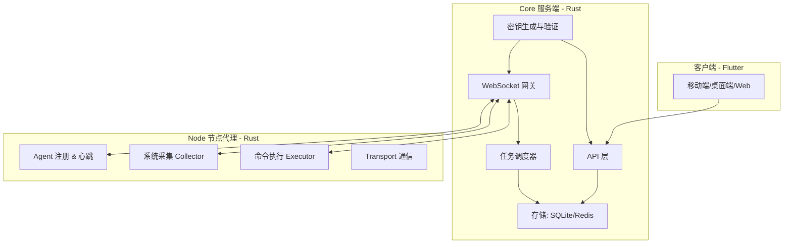

# Server Manager (Core + Node)

一个 **轻量级、开箱即用** 的分布式服务器管理系统，采用 **Rust** 编写。项目同时包含：

* **Core (服务端)**：管理节点注册、监控、命令分发、日志存储
* **Node (节点代理)**：运行在节点服务器，采集系统信息并执行远程命令

客户端使用 **Flutter**，可覆盖移动端、桌面端和 Web 页面。

---

## 📂 项目结构

```
server-manager/
├── core/                      # 核心服务端
│   ├── src/
│   │   ├── api/               # REST API 层
│   │   ├── ws/                # WebSocket 通信层
│   │   ├── scheduler/         # 任务调度与命令分发
│   │   ├── storage/           # SQLite & Redis 数据访问层
│   │   ├── models/            # 数据模型 (节点/命令/日志)
│   │   ├── security/          # 认证、TLS、安全策略
│   │   └── main.rs            # Core 入口
│   └── Cargo.toml
│
├── node/                      # 节点代理
│   ├── src/
│   │   ├── agent/             # 节点生命周期管理 (注册/心跳)
│   │   ├── collector/         # 系统信息采集 (CPU/内存/磁盘/网络)
│   │   ├── executor/          # 远程命令执行 (Shell/服务管理)
│   │   ├── transport/         # 通信层 (WebSocket/HTTP)
│   │   └── main.rs            # Node 入口
│   └── Cargo.toml
│
├── common/                    # Core 和 Node 共享模块
│   ├── src/
│   │   ├── proto/             # 消息协议定义 (JSON/WS 格式)
│   │   ├── config/            # 配置解析 (TOML)
│   │   ├── utils/             # 工具库
│   │   └── lib.rs
│   └── Cargo.toml
│
├── client/                    # Flutter 客户端 (可选在此或独立仓库)
│   └── ...
│
├── Cargo.toml                 # workspace 配置
└── README_SERVER.md           # 服务端说明
```

---

## 🧩 模块说明

### Core（服务端）

* **api/**：提供 REST API（节点查询、命令下发、历史数据查询）
* **ws/**：WebSocket 通道，维持与节点的实时连接
* **scheduler/**：任务调度中心，负责命令分发和异步任务队列
* **storage/**：SQLite 存储监控数据 & Redis 用于消息队列、缓存
* **models/**：定义节点、命令、日志的数据结构
* **security/**：密钥生成与验证、TLS 通信安全

### Node（节点代理）

* **agent/**：节点注册、心跳维护、状态同步
* **collector/**：系统信息采集（CPU/内存/磁盘/网络 IO）
* **executor/**：执行来自 Core 的命令（Shell、服务管理）
* **transport/**：通信模块，负责与 Core 建立 WS 长连接

### Common（共享库）

* **proto/**：定义 Core <-> Node 的消息格式
* **config/**：统一的配置加载模块（支持 TOML）
* **utils/**：日志、错误处理、工具函数

---

## 🔑 安全与注册逻辑

### Core 启动

* Core 启动时会检查是否已有密钥文件（例如 `./data/core.key`）。
* 如果不存在，则自动生成一个新的随机密钥并保存到文件。
* Core 使用该密钥来校验所有节点注册和客户端请求。

### 分发密钥

* 管理员可以通过 CLI 查看/导出密钥：

  ```bash
  ./server-manager-core key show
  # 输出: abcdef123456...
  ```
* 将此密钥配置到 Node (`config-node.toml`) 或客户端应用中。

### Node 注册

* Node 启动时，读取 `config-node.toml` 中的 `register_token`。
* Node → Core 发起注册请求，携带密钥。
* Core 验证成功后，分配 Node ID 并允许建立 WS 长连接。

### 客户端访问

* Flutter 客户端在首次连接时，需要提供同一密钥。
* Core 验证后才允许查询节点状态、下发命令。

---

## ⚙️ 工作流程

### 节点注册

1. Core 启动并生成/加载密钥
2. Node 启动 → 读取配置文件中的密钥
3. Node → Core 发送注册请求
4. Core 验证成功 → 分配 Node ID → 返回注册成功

### 心跳与监控

1. Node 周期性采集系统信息
2. Node → Core 发送心跳包（CPU、内存、磁盘、网络等）
3. Core 存储监控数据到 SQLite，同时写入 Redis 缓存
4. 客户端通过 API/WS 查询节点状态

### 命令下发与执行

1. 客户端 → Core 请求执行命令
2. Core → Node 下发执行任务（通过 WS）
3. Node → 本地执行命令（executor 模块）
4. Node → Core 返回执行结果
5. Core → 存储日志 & 推送客户端

---

## 🏗 架构图



---

## 🔨 构建与运行

### 构建

```bash
git clone https://github.com/your-org/server-manager.git
cd server-manager
cargo build --release
```

### 启动 Core 服务

```bash
./target/release/server-manager-core --config ./config-core.toml

# 查看 Core 生成的密钥
./target/release/server-manager-core key show
```

### 启动 Node 代理

```bash
./target/release/server-manager-node --config ./config-node.toml
```

---

## 📑 配置文件示例

### Core 配置 (`config-core.toml`)

```toml
[server]
listen = "127.0.0.1:9999"

[storage]
sqlite_path = "./data/server_manager.db"
redis_url = "redis://127.0.0.1:6379"
```

### Node 配置 (`config-node.toml`)

```toml
[node]
core_addr = "ws://127.0.0.1:9999"
register_token = "abcdef123456"   # 从 Core 导出的密钥
hostname = "node-01"
```
