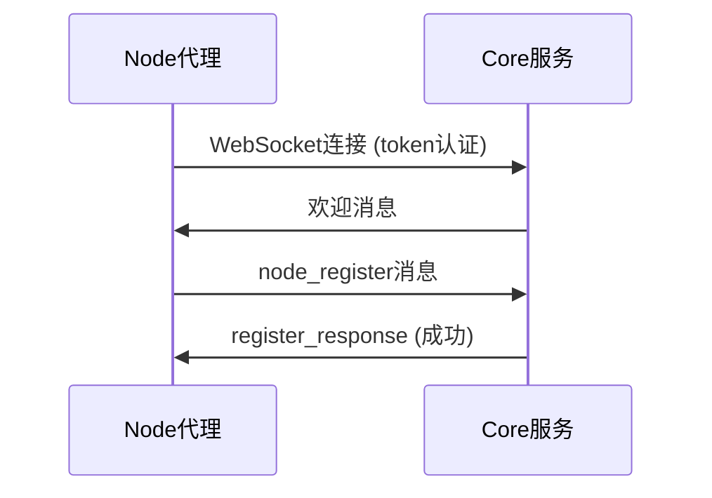
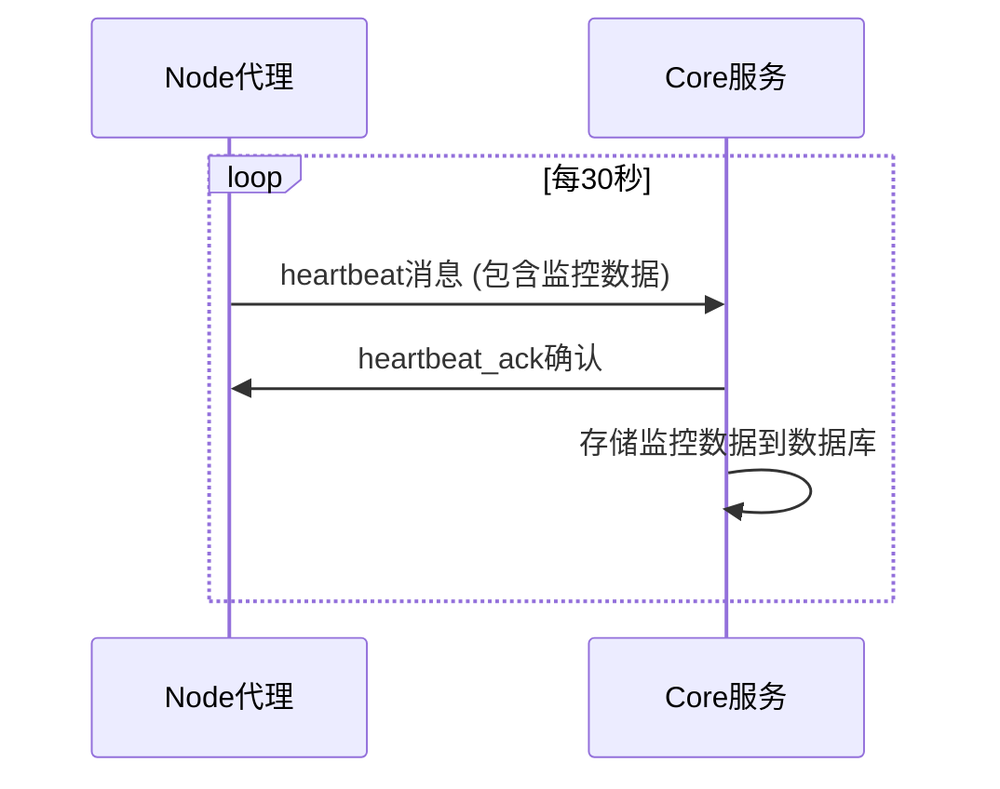
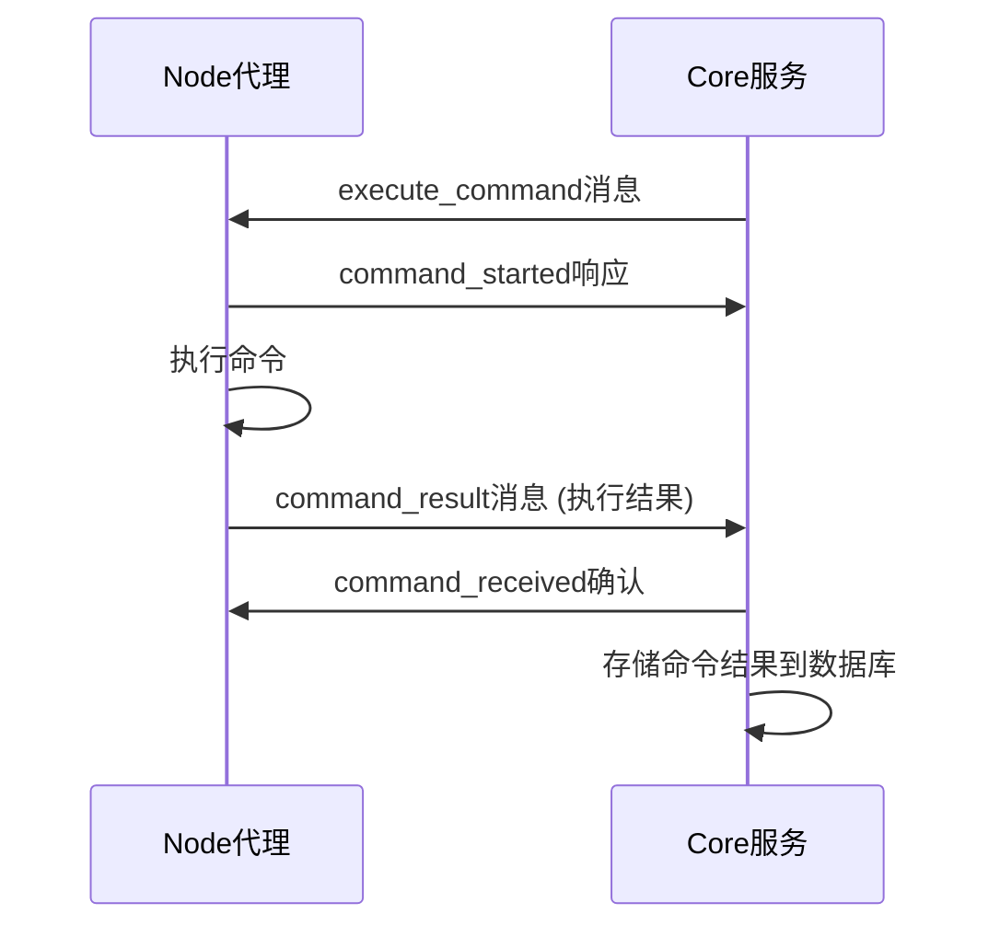

# WebSocket 通信示例文档

## 📋 概述

本文档提供分布式服务器管理系统中WebSocket通信的详细示例，包括各种消息类型的请求和响应格式。

---

## 🔌 连接方式

### WebSocket连接URL
```
ws://localhost:9999/api/v1/ws?token=default-token&node_id=node-001
```

**参数说明:**
- `token`: 认证令牌 (MVP版本使用固定值 `default-token`)
- `node_id`: 节点唯一标识符 (可选，不提供时自动生成UUID)

---

## 📨 消息格式

所有WebSocket消息采用统一的JSON格式：

```json
{
  "type": "消息类型",
  "id": "消息唯一标识符",
  "timestamp": "ISO 8601时间戳",
  "data": { /* 具体数据内容 */ }
}
```

---

## 🔄 消息类型示例

### 1. 节点注册 (Node → Core)

#### 请求示例
```json
{
  "type": "node_register",
  "id": "123e4567-e89b-12d3-a456-426614174000",
  "timestamp": "2025-01-21T10:00:00Z",
  "data": {
    "node_id": "node-001",
    "hostname": "server-01",
    "ip_address": "192.168.1.100",
    "os_info": "Ubuntu 22.04 LTS"
  }
}
```

#### 响应示例
```json
{
  "type": "register_response",
  "id": "123e4567-e89b-12d3-a456-426614174000",
  "timestamp": "2025-01-21T10:00:01Z",
  "data": {
    "success": true,
    "message": "节点注册成功",
    "node_id": "node-001"
  }
}
```

---

### 2. 心跳与监控数据 (Node → Core)

#### 请求示例
```json
{
  "type": "heartbeat",
  "id": "223e4567-e89b-12d3-a456-426614174001",
  "timestamp": "2025-01-21T10:00:30Z",
  "data": {
    "node_id": "node-001",
    "status": "online",
    "metrics": {
      "cpu_usage": 45.2,
      "memory_usage": 68.5,
      "disk_usage": 34.1,
      "load_average": 1.23
    }
  }
}
```

#### 响应示例
```json
{
  "type": "heartbeat_ack",
  "id": "223e4567-e89b-12d3-a456-426614174001",
  "timestamp": "2025-01-21T10:00:30Z",
  "data": {
    "received": true,
    "node_id": "node-001"
  }
}
```

---

### 3. 命令执行 (Core → Node)

#### 命令下发示例
```json
{
  "type": "execute_command",
  "id": "323e4567-e89b-12d3-a456-426614174002",
  "timestamp": "2025-01-21T10:01:00Z",
  "data": {
    "command_id": "cmd-001",
    "command_text": "ls -la /home",
    "timeout": 30
  }
}
```

#### 命令开始响应 (Node → Core)
```json
{
  "type": "command_started",
  "id": "323e4567-e89b-12d3-a456-426614174002",
  "timestamp": "2025-01-21T10:01:01Z",
  "data": {
    "command_id": "cmd-001"
  }
}
```

#### 命令结果 (Node → Core)
```json
{
  "type": "command_result",
  "id": "423e4567-e89b-12d3-a456-426614174003",
  "timestamp": "2025-01-21T10:01:02Z",
  "data": {
    "command_id": "cmd-001",
    "exit_code": 0,
    "stdout": "total 24\ndrwxr-xr-x 3 user user 4096 Jan 21 10:00 .\ndrwxr-xr-x 5 root root 4096 Jan 20 09:00 ..\ndrwxr-xr-x 2 user user 4096 Jan 21 09:30 documents",
    "stderr": "",
    "execution_time_ms": 125
  }
}
```

#### 命令接收确认 (Core → Node)
```json
{
  "type": "command_received",
  "id": "423e4567-e89b-12d3-a456-426614174003",
  "timestamp": "2025-01-21T10:01:02Z",
  "data": {
    "received": true,
    "node_id": "node-001"
  }
}
```

---

### 4. 错误处理

#### 错误消息示例
```json
{
  "type": "error",
  "id": "523e4567-e89b-12d3-a456-426614174004",
  "timestamp": "2025-01-21T10:00:05Z",
  "data": {
    "error_code": "INVALID_TOKEN",
    "message": "认证令牌无效",
    "details": "Token已过期或格式错误"
  }
}
```

#### 解析错误示例
```json
{
  "type": "error",
  "id": "623e4567-e89b-12d3-a456-426614174005",
  "timestamp": "2025-01-21T10:00:06Z",
  "data": {
    "error_code": "PARSE_ERROR",
    "message": "消息解析失败",
    "details": "JSON解析错误: 期望值在位置10"
  }
}
```

#### 未知消息类型错误
```json
{
  "type": "error",
  "id": "723e4567-e89b-12d3-a456-426614174006",
  "timestamp": "2025-01-21T10:00:07Z",
  "data": {
    "error_code": "UNKNOWN_MESSAGE_TYPE",
    "message": "未知的消息类型: invalid_type",
    "details": "支持的消息类型: node_register, heartbeat, command_result"
  }
}
```

---

### 5. 连接欢迎消息 (Core → Node)

#### 连接成功欢迎消息
```json
{
  "type": "welcome",
  "id": "823e4567-e89b-12d3-a456-426614174007",
  "timestamp": "2025-01-21T10:00:00Z",
  "data": {
    "message": "欢迎连接到Server Manager Core",
    "node_id": "node-001"
  }
}
```

---

## 🚀 完整通信流程示例

### 节点注册流程


### 心跳监控流程


### 命令执行流程


---

## 🔐 错误码说明

| 错误码 | 说明 | 建议处理方式 |
|--------|------|-------------|
| `INVALID_TOKEN` | 认证令牌无效 | 检查token配置，重新连接 |
| `NODE_NOT_FOUND` | 节点不存在 | 重新发送注册消息 |
| `COMMAND_TIMEOUT` | 命令执行超时 | 检查网络连接或命令复杂度 |
| `PARSE_ERROR` | 消息解析失败 | 检查JSON格式是否正确 |
| `UNKNOWN_MESSAGE_TYPE` | 未知消息类型 | 检查消息类型拼写 |
| `DATABASE_ERROR` | 数据库操作失败 | 等待重试或联系管理员 |

---

## 💡 最佳实践

1. **消息ID生成**: 使用UUID v4确保全局唯一性
2. **时间戳格式**: 使用ISO 8601格式 (RFC 3339)
3. **错误处理**: 所有操作都应该有相应的错误响应
4. **重试机制**: 对于重要消息实现重试逻辑
5. **心跳间隔**: 建议30秒一次，避免过于频繁
6. **超时设置**: 命令执行设置合理的超时时间

---

## 🧪 测试工具

可以使用以下工具测试WebSocket通信：

1. **websocat**: 命令行WebSocket客户端
   ```bash
   websocat ws://localhost:9999/api/v1/ws?token=default-token
   ```

2. **Postman**: 支持WebSocket测试
3. **浏览器开发者工具**: 直接测试WebSocket连接

---

*最后更新: 2025-01-21*
